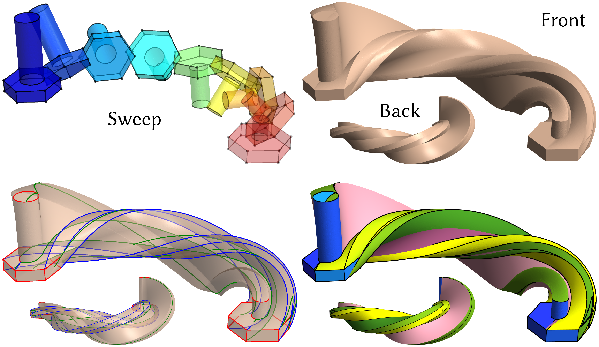

# CSG Sweeps: Feature-aware sweep surfacing of deformable CSGs

This code implements the ACM SIGGRAPH ASIA 2026 paper: CSG Sweeps: Feature-aware sweep surfacing of deformable CSGs



>A bolt-like CAD model moves along a half-circle trajectory. During the motion, it self-rotates about an axis through the midpoint of its height, perpendicular to its vertical height axis. Its cylindrical shaft gradually becomes thinner and shorter, forming a twisted, tapered swept solid with a hexagonal base.

Given any sweep represented as a smooth time-varying CSG tree function satisfying a genericity assumption, this algorithm produces a watertight and intersection-free surface that faithfully approximates the geometric and topological features.

## Build

### Dependencies

All third-party libraries are open-source and automatically fetched using CMake.

### C++ Build

Use the following command to build:

```bash
mkdir build
cd build
cmake -DCMAKE_BUILD_TYPE=Release ..
make
```
The C++ library `libsweep` and the command line tool `generalized_sweep` will be generated in the
build directory.

<!-- ### Python Bindings

We also provide a Python binding for easy integration with Python workflows:

```bash
# Install the Python package
pip install sweep3d
``` -->

## Usage

### C++ API

The C++ API consists of two simple functions, `generalized_sweep` and
`generalized_sweep_from_config` defined in `include/sweep/generalized_sweep.h`.
For complete API documentation, please see [generalized_sweep.h](include/sweep/generalized_sweep.h).

#### `generalized_sweep`

The `generalized_sweep` function provides the most general API. It takes the following inputs:

* a user-provided space-time function for pointwise function and gradient evaluation,
* (optional) a simple initial grid specification ([doc](#grid-parameters)), and
* (optional) customized sweep parameters ([doc](#sweep-options))

and generates the following outputs:

* Sweep surface (final output)
* Sweep features (final output)
<!-- * Sweep envelope -->
<!-- * Envelope arrangement -->

In addition to the sweep surface, our code also provides the sweep envelope and envelope
arrangement for advanced users. Please see our paper for their definitions.

Here is a simple example:

```c++
#include <sweep/generalized_sweep.h>
#include <lagrange/io/save_mesh.h> // For IO only

// Define implicit csg tree function from a yaml file
auto funPtr = stf::parse_space_time_function_from_file<3>(args.function_file);
auto managed = dynamic_cast<stf::ManagedSpaceTimeFunction<3>*>(funPtr.get());
auto csgTreePtr = dynamic_cast<stf::CSGTree<3>*>(managed->get_function());

// Define an  grid and options
sweep::GridSpec grid_spec;
sweep::SweepOptions options;
options.out_dir = output_path;
...
// Compute the sweep surface
auto result = sweep::generalized_sweep_csg(csgTreePtr, grid_spec, options);
lagrange::io::save_mesh("sweep_surface.obj", result.sweep_surface);
```

#### `generalized_sweep_from_config`

The `generalized_sweep_from_config` function loads two configuration files:
* `function_file` defines the CSG tree function
* `config_file` defines the initial grid spec and sweep parameters

It outputs the same set of meshes as `generalized_sweep`. Both `function_file` and `config_file`
are in YAML format.


The CSG function file is a YAML file that defines a space-time function supported by the [space-time-functions](https://github.com/adobe-research/space-time-functions) library.
Here is a simple function file that sweeps a ball along the X axis. Please see the [spec](https://github.com/adobe-research/space-time-functions/blob/main/doc/yaml_spec.md) for a complete set of supported transforms and shapes.

```yaml
type: csg
dimension: 3
root:
  op: intersection
  transform:
    type: compose
    transforms:
      - type: translation
        vector: [-1.0, 0.0, 0.0]
      - type: rotation
        axis: [1.0, 0.0, 0.0]
        angle: 60.0
        center: [0.0, 0.0, 0.0]
  left:
    negate: false
    type: ball
    center: [-0.06643, 0.216329, -0.050121]
    radius: 0.737501
  right:
    op: intersection
    left:
      negate: false
      type: ball
      center: [-0.099182, 0.125618, 0.201075]
      radius: 0.735332
    right:
      negate: true
      type: ball
      center: [-0.131273, -0.14916, -0.236873]
      radius: 0.301939
```

The `config_file` is used to specify the initial grid and the sweep options. Here is an example:

```yaml
grid:
  resolution: [4, 4, 4]
  bbox_min: [-1, -1, -1]
  bbox_max: [1, 1, 1]

parameters:
  epsilon_env: 0.0001
  epsilon_sil: 0.0001
  with_insideness_check: true
  with_adaptive_refinement: true
   min_tet_edge_length: 0.005
```

The parameters section will be used to construct the `sweep::SweepOptions`.

Here is an example:

```c++
#include <sweep/generalized_sweep.h>
#include <lagrange/io/save_mesh.h> // For IO only

auto r = sweep::generalized_sweep_from_config(
    "example/simple/sweep.yaml",
    "example/simple/config.yaml"
);
lagrange::io::save_mesh("sweep_surface.obj", r.sweep_surface);
```
Please see more config-files-based examples in the [example](example) folder.

### Python API
```python
To do
```
Please see `help(sweep3d)` for more details.


## Grid Parameters

The `GridSpec` struct defines the initial spatial grid used for sweep computation. The grid represents the 3D spatial domain (the time dimension is handled separately).

### Parameters

| Parameter | Type | Default | Description |
|-----------|------|---------|-------------|
| `resolution` | `[int, int, int]` | `[4, 4, 4]` | Number of grid cells in the x, y, z directions. Higher resolution provides better initial sampling but increases computation time. |
| `bbox_min` | `[float, float, float]` | `[-0.2, -0.2, -0.2]` | Minimum corner of the axis-aligned bounding box that encloses the sweep volume. |
| `bbox_max` | `[float, float, float]` | `[1.2, 1.2, 1.2]` | Maximum corner of the axis-aligned bounding box that encloses the sweep volume. |

**Note:** The bounding box should be large enough to fully enclose the swept volume throughout the entire trajectory (t ∈ [0, 1]).

## Sweep Options

The `SweepOptions` struct provides fine-grained control over the sweep computation. All parameters are optional and have sensible defaults.

### Refinement Parameters

| Parameter | Type | Default | Description |
|-----------|------|---------|-------------|
| `epsilon_env` | `double` | `1e-4` | Tolerance for envelope approximation. |
| `epsilon_sil` | `double` | `1e-4` | Tolerance for silhouette set approximation. |
<!-- | `max_split` | `int` | unlimited | Maximum number of splits allowed during grid refinement. | -->
| `with_insideness_check` | `bool` | `true` | Whether to perform insideness checks during grid refinement. If true, the algorithm will stop refinement early once it detects a cell is inside the swept volume. |
| `with_adaptive_refinement` | `bool` | `true` | Enable/disable adaptive grid refinement. |
| `initial_time_samples` | `size_t` | `8` | Number of initial uniform time samples per spatial grid vertex. |
| `min_time_edge_length` | `size_t` | `4` | The time distance between two neighboring time samples, the real float value should be min_time_edge_length/1024, as time range (0-1) mapped to (0, 1024) |


### Quality Control Parameters

| Parameter | Type | Default | Description |
|-----------|------|---------|-------------|
| `min_tet_radius_ratio` | `double` | `1e-5` | Minimum acceptable tetrahedron in-radius to circum-radius ratio during grid refinement. Tets below this threshold will not be refined further. |
| `min_tet_edge_length` | `double` | `0.005` | Minimum acceptable tetrahedron edge length during grid refinement. Tets with longest edge below this threshold will not be refined further. |

### Surface Extraction Parameters

| Parameter | Type | Default | Description |
|-----------|------|---------|-------------|

| `with_snapping` | `bool` | `true` | Whether to enable vertex snapping during isocontouring. Improves the quality of the extracted mesh. |
| `volume_threshold` | `double` | `1e-5` | Minimum volume threshold for arrangement cell filtering. Cells below this volume will be merged into adjacent cells. |
| `face_count_threshold` | `size_t` | `200` | Minimum face count threshold for arrangement cell filtering. Cells below this face count will be merged into adjacent cells. |
| `use_mix_cell_complex` | `bool` | `false` | Whether to build a hybrid columns(4 cells) with the detected active separators in each 4D column|

<!-- ### Advanced Parameters

| Parameter | Type | Default | Description |
|-----------|------|---------|-------------|
| `cyclic` | `bool` | `false` | Whether the trajectory is cyclic. ⚠️ This feature is experimental and not fully supported. | -->

## Configuration Examples

The following examples show how to configure both grid parameters and sweep options together:

<details>
<summary><b>C++ Example</b></summary>

```c++
#include <sweep/generalized_sweep.h>

// Configure grid
sweep::GridSpec grid;
grid.resolution = {4, 4, 4};
grid.bbox_min = {-1.5, -1.5, -1.5};
grid.bbox_max = {1.5, 1.5, 1.5};

// Configure sweep options
sweep::SweepOptions options;
options.epsilon_env = 1e-3;
options.epsilon_sil = 1e-3;
options.with_insideness_check = true;

// Compute sweep
auto result = sweep::generalized_sweep(f, grid, options);
```

</details>
<!-- 
<details>
<summary><b>Python Example</b></summary>

```python
import sweep3d

# Configure grid
grid_spec = sweep3d.GridSpec()
grid_spec.resolution = [4, 4, 4]
grid_spec.bbox_min = [-0.5, -0.5, -0.5]
grid_spec.bbox_max = [1.5, 1.5, 1.5]

# Configure sweep options
options = sweep3d.SweepOptions()
options.epsilon_env = 1e-3
options.epsilon_sil = 1e-3
options.with_insideness_check = False
options.max_split = 1000000

# Compute sweep
result = sweep3d.generalized_sweep(my_function, grid_spec, options)
```

</details> -->

<details>
<summary><b>YAML Example</b></summary>

```yaml
grid:
    resolution: [4, 4, 4]
    bbox_min: [-0.5, -0.5, -0.5]
    bbox_max: [1.5, 1.5, 1.5]

parameters:
    epsilon_env: 1e-3
    epsilon_sil: 1e-3
    with_insideness_check: true
    max_split: 1000000
```

</details>
